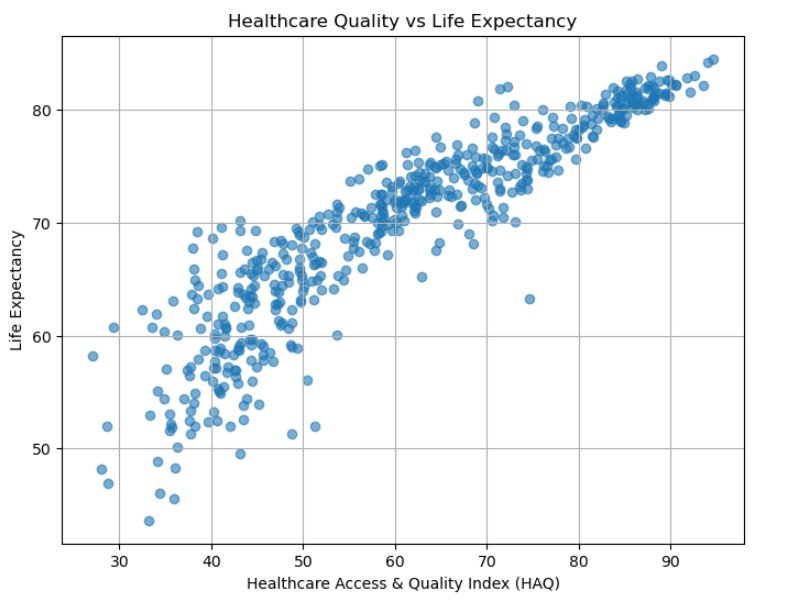
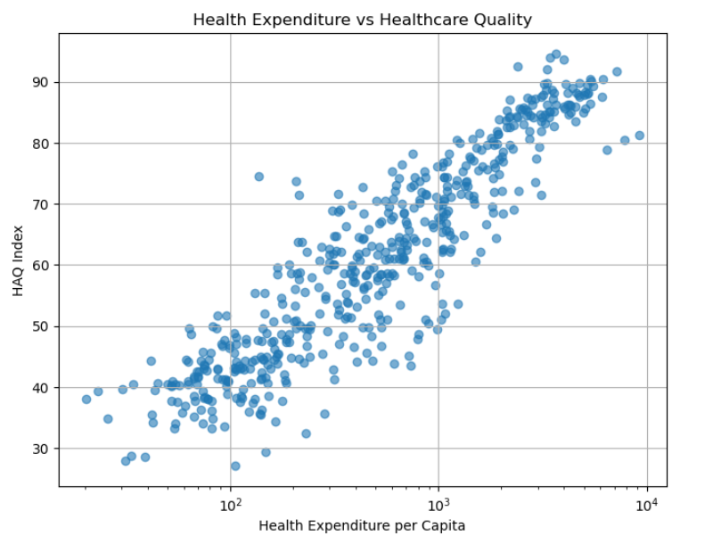
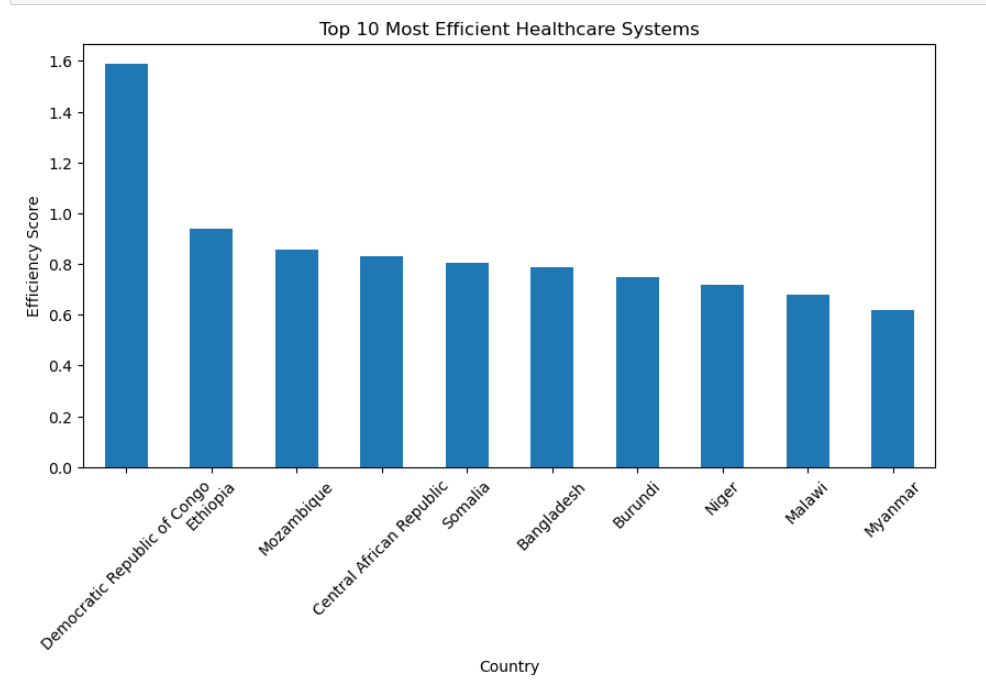
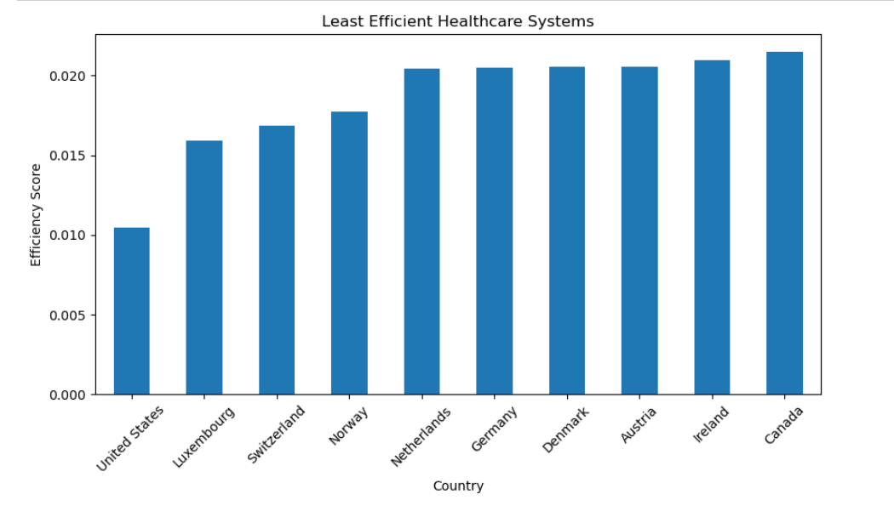
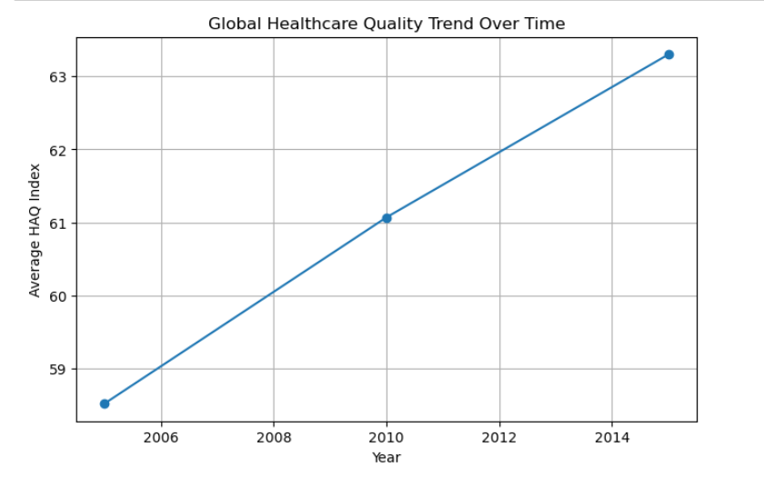

# 🏥 Healthcare Performance & System Efficiency Analytics — Power BI & Python

An end-to-end healthcare analytics project integrating multiple global datasets to evaluate healthcare quality, expenditure, and system efficiency across countries, with actionable insights for policy and resource optimization.

---

## 📌 Table of Contents

1. Business Problem  
2. Dataset Overview  
3. Data Model  
4. Dashboard Pages  
5. Key Metrics & Feature Engineering  
6. Key Findings  
7. Recommendations  
8. Methodology Notes  
9. Tech Stack  
10. How to Reproduce  
11. Dashboard Preview  
12. Contact  

---

## 🧠 Business Problem

Healthcare systems globally face a critical challenge:

> Does higher spending actually lead to better health outcomes?

Governments and policymakers need to answer:
- Are healthcare investments translating into improved population health?
- Which countries deliver the best outcomes relative to spending?
- Where do inefficiencies exist in healthcare systems?

This project analyzes global healthcare performance using:
- Healthcare Access & Quality Index (HAQ)
- Life Expectancy
- Health Expenditure per Capita

---

## 📂 Dataset Overview

Sources: Public datasets (Our World in Data, IHME)

Key Fields Used:

| Field | Description |
|------|------------|
| Country | Country name |
| Year | Observation year |
| HAQ_Index | Healthcare quality indicator |
| Life_Expectancy | Average life expectancy |
| Health_Expenditure | Spending per capita |

Time Range: 2002–2016 (aligned across datasets)

---

## 🏗️ Data Model

Healthcare Dataset

Country  
Year  
HAQ_Index  
Life_Expectancy  
Health_Expenditure  

Derived Metric:

Efficiency Score = HAQ_Index / Health_Expenditure

This measures how efficiently healthcare spending translates into outcomes.

---

## 📊 Dashboard Pages

Page 1: Executive Overview  
- KPI Cards (HAQ, Life Expectancy, Expenditure, Efficiency)  
- Scatter plots (Quality vs Outcome, Spending vs Quality)  
- Trend over time  

Page 2: Country Performance  
- Top performing countries  
- Comparative analysis  

Page 3: Efficiency Analysis  
- Top efficient systems  
- Least efficient systems  

Page 4: Trend Analysis  
- Healthcare quality over time  
- Life expectancy trends  

---

## 🧮 Key Metrics & Feature Engineering

Efficiency Score:
HAQ_Index / Health_Expenditure

Purpose:
Measures how effectively healthcare spending produces quality outcomes.

---

## 🔍 Key Findings

1. Healthcare quality strongly correlates with life expectancy  
Countries with higher HAQ scores consistently have higher life expectancy  

2. Spending improves outcomes but with diminishing returns  
Higher expenditure improves quality, but gains reduce at higher levels  

3. Efficiency gaps exist  
Some countries achieve high outcomes with low spending  
Others spend more but achieve less  

4. Global healthcare performance is improving  
Healthcare quality has steadily increased over time  

---

## 💡 Recommendations

- Focus on efficiency, not just spending  
- Benchmark high-performing countries  
- Optimize resource allocation  
- Invest in healthcare system quality  

---

## 🧾 Methodology Notes

Data Integration:
- Merged datasets on Country and Year  
- Aligned years (2002–2016)  
- Standardized column names  

Data Cleaning:
- Converted numeric fields  
- Removed missing values  

Limitations:
- Country-level analysis only  
- Efficiency score is a proxy  
- No demographic or disease-level data  

---

## 🛠️ Tech Stack

- Python (pandas, matplotlib, seaborn)  
- Power BI (dashboard)  
- Excel (validation)  
- SQL (optional)  

---

## 🚀 How to Reproduce

1. Clone the repository  
2. Open healthcare_final.csv  
3. Run Python scripts  
4. Open Power BI (.pbix file)  
5. Explore dashboard  

---

## 📊 Dashboard Preview

| Relationship Between Healthcare Quality and Life Expectancy |Impact of Healthcare Expenditure on System Quality (HAQ Index) |
|------------------|------------------|
|  |  |

---

| Top 10 Most Efficient Healthcare Systems by Quality-to-Spending Ratio | Bottom 10 Healthcare Systems by Efficiency (High Spending, Lower Outcomes) |
|------------------|------------------|
|  |  |

---

|Global Trend in Healthcare Quality (HAQ Index) Over Time | Correlation Between Healthcare Quality, Expenditure, and Life Expectancy |
|------------------|------------------|
|  |  |

---

## 📌 Project Summary

This project demonstrates:
- Multi-source data integration  
- Data cleaning and transformation  
- Feature engineering  
- Data visualization  
- Business insight generation  

---

## 👤 Contact

Bulus Umoru  
Data Analyst | Data Architect  
Potsdam, Germany  

LinkedIn: https://www.linkedin.com/in/bulus-umoru/  

---

## ⭐ If you found this useful
Give this repo a star and connect with me on LinkedIn
